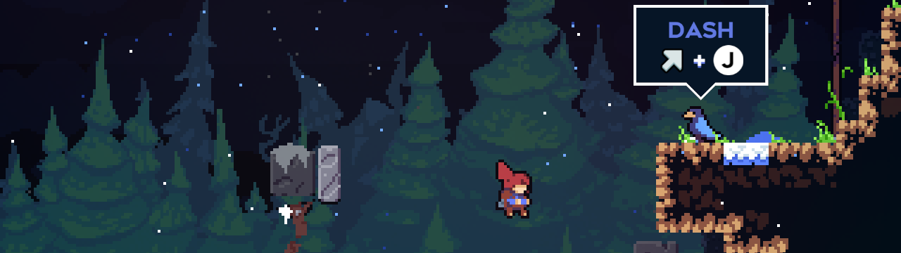
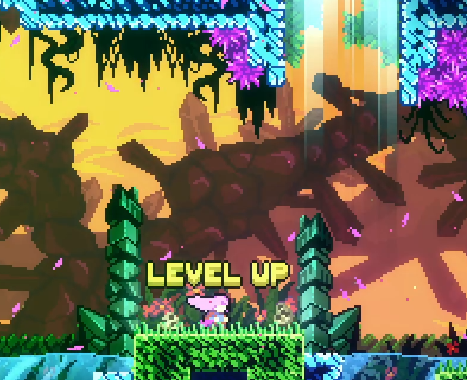

# Building Habits: Developing Fundamentals of Celeste Speedrunning

## Table of Contents
- [Introduction](#introduction)
- [Level 1](./level1.md)
- [Level 2](./level2.md)
- [Level 3](./level3.md)
- [Level 4](./level4.md)
- [Closing thoughts](./conclusions.md)
- [FAQ](./faq.md)

## Introduction
"Building habits" is originally a YouTube series from Grandmaster Aman Hambleton (Chessbrah) as both an educational and entertaining method to gradually improve at chess. Aman follows a strict set of rules to simulate playing at various levels of gameplay, from complete beginner to a fairly advanced level (0-2000 ELO). The goal is not to always be playing optimally or win every game, but to focus on "high-percentage" moves that are usually but not always good. Eventually, the habits series concludes at around 2000 ELO as the fundamentals can only take you so far, and attention to niche details and specific variations becomes increasingly important.

For those curious, [the chess series can be found here](https://www.youtube.com/watch?v=ibDX4ReEikQ&list=PLUjxDD7HNNThwCNW3f36RZcMxPwQIjYae). Those familiar with chess and the rules will find parallels in this series. As a casual chess enjoyer and dedicated Celeste speedrunner, I've been inspired to attempt to apply this philosophy towards Celeste speedrunning starting from a complete beginner level. My approach to learning is also largely rooted in learning the fundamentals first before learning to break them. In summary, the goals of the Celeste habits are to:

- Master basic movement mechanics
- Develop fundamentals incrementally
- Pattern recognition of common setups

Note that "getting the fastest time we can" is **not** an explicit goal of the habits. The philosophy here is that fast times will naturally follow upon mastery of the fundamentals. Just like in the chess habits, as our skills improve, we will add more layers of habits over the course of 4 levels, starting from a complete beginner, and compounding on skills and concepts learned in previous levels. A key focus will be on **incremental learning**, where we gradually increase our skillsets and knowledge to not overwhelm ourselves with details. A common theme will be learning fundamental principles at one level, and then applying them in more specific ways at higher levels.

---

[&#8593; Back to top](#building-habits-developing-fundamentals-of-celeste-speedrunning)

[Level 1 &#8594;](./level1.md) 
