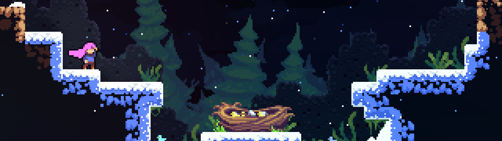

[Back to main page](./README.md)

# Closing Thoughts

To summarize the habits at each level:

- Level 1 emphasized having a plan for every room
- Level 2 introduced basic speed tech and active movement
- Level 3 introduced the use of leniency mechanics
- Level 4 focused on optimizing movement and taking advantage of the buffer system

Reflecting on the goals of the habits, the early levels started with developing mastery of the basic inputs, followed by learning to use speed tech. None of the speed tech is highly technical to perform: mainly learning the extension timing requires learning an arbitrary muscle-memory. Speed tech is only ever used in the context of having a plan or setup, and is only as hard as the setup demands. The intent of the gradual introduction of speed tech is to cement mastery of the basic actions of jump, dash, and grab before moving on towards more advanced ones.

Later levels focused on developing strats with consistency using leniency mechanics and keeping an open eye for active movement. Level 4 began to dive into some of the more granular details for optimizing movement, but my intent was to focus on movement themes that are commonly recurring to build pattern recognition.

Habits cap out as we approach higher levels of gameplay. In chess, a lot of the higher level learning becomes learning when to break the habits. My opinion is that in Celeste, further learning becomes paying attention to increasingly granular levels of detail, and trying to rely only on the fundamentals becomes limited. The fundamentals are always necessary but not always sufficient.

Thank you for reading. I hope this was instructive (and entertaining if you watched the videos). Any feedback is welcome, you can DM me on Discord (kwan22).

---

# Acknowledgements

Thanks to Aman Hambleton for inspiring the Building Habits series.  
Thanks to wonderginger, yujene, and zaj mahal for their support and enthusiasm in brainstorming and peer review.  
And of course, thanks to Celeste and the associated speedrunning community.

---

# Other useful resources

[Celeste Discord](https://discord.gg/celeste). Main hub of Celeste's speedrunning community and contains various resources for speedrunners of all skill levels.  
[Celeste speedrun leaderboard](https://www.speedrun.com/celeste). Useful to check out strats performed by runners of all skill levels. Also contains various resources and guides.

My PB VODs while following the habits, serving as reference of which strats I picked for each level.
[Level 1 pb](https://www.youtube.com/watch?v=LAsIb5jsIIY&list=PLPTo7ZG8_ivJeRmLJuRWTr4uKLZWku67l&index=2&t=39)
[Level 2 pb](https://www.youtube.com/watch?v=rcYDBxwVx-0&list=PLPTo7ZG8_ivJeRmLJuRWTr4uKLZWku67l&index=5&t=33)
[Level 3 pb](https://www.youtube.com/watch?v=K1lFC1wd4YA&list=PLPTo7ZG8_ivJeRmLJuRWTr4uKLZWku67l&index=7&t=4751)
[Level 4 pb](https://www.youtube.com/watch?v=UnU0Phe5E2w&list=PLPTo7ZG8_ivJeRmLJuRWTr4uKLZWku67l&index=10&t=152)

[&#8593; Back to top](#closing-thoughts)

[FAQ &#8594;](./faq.md) 
